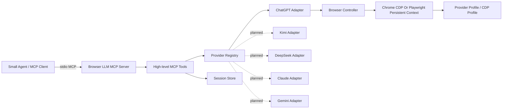

# Browser LLM MCP Architecture And Roadmap

This document is the stable project overview. Use it to understand the intended architecture, current implementation status, and next planned work. Use `MEMORY.md` for chronological per-round change notes.

## Product Goal

Browser LLM MCP lets a small-model agent call a local MCP server, send a prompt, and receive the complete text response from a logged-in browser LLM web app.

The product intent is not browser automation for its own sake. The point is to let a smaller or cheaper agent act as the orchestrator while borrowing the capabilities of a stronger web LLM when deeper reasoning, broader knowledge, or higher-quality synthesis is needed.

The server controls the browser like a user:

1. Open the provider web app with a dedicated browser profile.
2. Use the user's existing web login state.
3. Type the prompt.
4. Wait for the assistant response to finish.
5. Extract the latest complete assistant text.
6. Return structured JSON to the MCP client.

The first real provider is ChatGPT Web. Kimi, DeepSeek, Claude, and Gemini are planned provider adapters so a small-model agent can route work to whichever stronger web LLM is available.

## Architecture



Core boundaries:

- MCP tools expose intent-level operations only; small agents do not receive low-level browser primitives.
- Provider adapters own website-specific login detection, prompt submission, waiting, extraction, and selector handling.
- Browser controller owns Playwright lifecycle, persistent profile launch, serialized provider work, and failure screenshots.
- Browser controller can attach to, or autostart and attach to, a local Chrome over CDP; on macOS with system Google Chrome installed this is now the default launch path.
- Session store maps an agent `sessionId` to a provider conversation URL, allowing follow-up prompts to continue the same web conversation.
- If a stored provider conversation URL becomes unavailable, the tool layer removes the stale mapping, starts a new provider conversation for the same `sessionId`, and returns a warning instead of forcing the agent to understand account-specific URLs.
- Continued sessions must wait for old transcript hydration to stabilize before submitting, then confirm prompt submission before waiting for the new assistant reply.
- The public `browser_llm_ask` contract does not expose a `conversation` parameter; new versus continued provider conversations are inferred from `sessionId`.
- Provider registry keeps implemented and planned providers behind one stable lookup path.

## Runtime Data

Default runtime home:

```text
~/.browser-llm-mcp/
```

Important paths:

- `profiles/<provider>`: Playwright persistent browser profile and login state.
- `sessions.json`: maps provider plus agent `sessionId` to one active provider conversation URL.
- `artifacts/`: failure screenshots and future diagnostic artifacts.

The project must not store passwords, API keys, cookies, or private prompt/response logs outside the browser profile.

## MCP Tool Contract

Current tools:

- `browser_llm_list_providers`
  - Lists enabled and planned providers.
- `browser_llm_open_login`
  - Opens a headed browser for manual provider login.
- `browser_llm_status`
  - Reports browser state, login state, queue state, profile path, and last error.
- `browser_llm_ask`
  - Sends a prompt and returns the complete assistant response text.
  - Prefer a stable `sessionId`; missing session ids create new provider conversations, existing session ids continue saved provider conversations.
  - If the saved provider conversation is not accessible, the stale mapping is replaced by a new conversation and the response includes a warning.
  - Optional `filePaths` let the MCP server read supported local text files and inline them into the submitted prompt so the calling agent does not need the raw file text in its own context.
- `browser_llm_close`
  - Closes browser contexts without deleting profiles.

Provider-required tools default omitted, null, or blank-string provider values to `chatgpt` to tolerate MCP clients that submit empty strings from form fields.

Current structured error codes:

```text
NOT_LOGGED_IN
TIMEOUT
SELECTOR_CHANGED
FILE_UNSUPPORTED
FILE_TOO_LARGE
FILE_READ_FAILED
BROWSER_PROFILE_LOCKED
RATE_LIMIT_OR_CAPTCHA
PROVIDER_DISABLED
PROVIDER_UNSUPPORTED
BROWSER_LAUNCH_FAILED
UNKNOWN
```

## Current Status

Completed:

- TypeScript project scaffold with MCP SDK, Playwright, Zod, Vitest, and build scripts.
- stdio MCP server.
- High-level MCP tool layer.
- Provider registry.
- ChatGPT Web adapter v1.
- Planned provider placeholders for Kimi, DeepSeek, Claude, and Gemini.
- Playwright browser controller with persistent profiles and single-provider queueing.
- Auto launch-mode selection with macOS defaulting to local Chrome CDP autostart.
- `sessionId` support through `SessionStore`.
- Local text-file prompt inlining for `.json`, `.md`, `.markdown`, `.txt`, and `.log`.
- Mock ChatGPT integration tests for prompt submission and response extraction.
- Unit tests for config, registry, queueing, and session persistence.
- MCP tool robustness tests for structured errors, malformed input, planned providers, and `sessionId` continuation.
- README and memory log.

Verified:

- `npm run typecheck`
- `npm test` currently covers 8 test files and 31 tests.
- `npm run build`

Known gaps:

- Real ChatGPT manual acceptance has not been recorded in this repo yet.
- ChatGPT human verification can loop on some automated browser, proxy, or new-profile combinations; persistent-profile and CDP attach mitigations are documented in `MANUAL_TEST.md`.
- ChatGPT Web selectors may drift and need maintenance.
- Kimi, DeepSeek, Claude, and Gemini adapters are not implemented yet.
- No HTTP transport yet.
- No provider adapter template yet.
- No automated real-provider tests, because they would require live accounts and are brittle.
- Real-provider manual testing is documented in `MANUAL_TEST.md`.

## Next Plan

Near-term:

1. Run the `MANUAL_TEST.md` real MCP client acceptance checklist for ChatGPT.
2. Harden ChatGPT adapter based on real-page behavior:
   - update selectors;
   - improve streaming completion detection;
   - improve login/captcha/rate-limit detection;
   - improve failure screenshots and diagnostic details.
3. Add Kimi adapter as the second real provider, reusing the existing provider interface and session store.

Mid-term:

1. Add DeepSeek adapter.
2. Add a provider adapter template after ChatGPT plus Kimi reveal the common pattern.
3. Add optional headless mode documentation after headed mode is stable.
4. Add richer status details for queued/running requests.
5. Add a small local MCP smoke-test script that calls the server through stdio.

Later:

1. Add Claude and Gemini adapters.
2. Consider Streamable HTTP transport only if multiple clients need to share a server.
3. Add provider capability metadata such as file upload, image input, model picker, and conversation naming.
4. Add optional per-provider policy controls for rate limiting, max prompt length, and privacy-safe diagnostics.

## Extension Pattern For New Providers

To add a provider:

1. Add or enable the provider in `ProviderRegistry`.
2. Implement `ProviderAdapter`.
3. Use a provider-specific Playwright profile path.
4. Implement login detection, prompt composer lookup, submit action, response wait, and latest assistant extraction.
5. Return only the stable `AskResult` shape to the MCP layer.
6. Add mock-page integration tests before testing the real website.
7. Update this document and `MEMORY.md`.

The MCP tool contract should not change when a new provider is added unless the new provider needs a capability that cannot fit the existing `ask/status/login/close` model.
